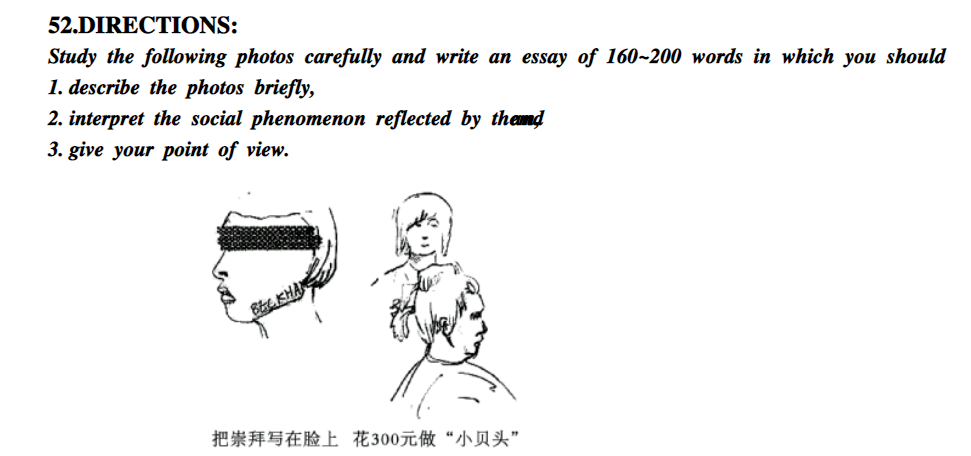

### 自己的文章

The image on the left shows a young man who has his favorite star's name tattooed on his face. In the other a youth is making an expensive haircut to express adoration for his idol. Though astonishing at the first glance, these are vivid pictures on irrational adoration for idols.

It is worrying that irrational adoration for idols has become common among contemporary young people. Many youth prefer to change their appearance as a sign of being someone's fans. Such untraditional appearance can make others who are not familiar with them uncomfortable and thus may have a negative effect on social networking. Moreover, college students who adore their idols irrationally tend to spend less time on their courses, which may lead to poorer academic performance. 

Though it is perfectly fine to have one's own favorite stars, instead of "materializing" admiration into tattoo and haircut, one may well turn it into willpower that encourage himself to pursuit his own career. It is also important never to forget people around you and keep sharp on new things so as to establish strong social network and take advantage of every chance to become better.

### 基本思路

第一段描述图片和说明寓意各一句话，感觉不太够中间又加了一句过渡性质的（一半描述图，一半描述想法）。

第二段就是为什么赞成“照顾老人很重要”的观点。分了两点来写。

最后一段重复观点和原因。

### 遇到的问题

tattoo既可以做名词也可以用作动词，动词就是将...纹在身上

**范文书上特别提到了其它的关于表达方法：**worship, idolatry(专指偶像崇拜，这个就牛逼了)，excessive admiration for heroes(感觉这个和自己用的irrational admiration for stars 差不多嘿嘿)...

时间用了45分钟，仍然不够用。但个人感觉草稿还是必要的，特别是誊写的时候还可以进行二次修改。这篇文章最困难的是列提纲，首先尽管要反驳但是仍然不知道反驳啥，其次是想好怎么说了发现英文不会写（感觉写的还是挺苍白...），关于初稿之前要完成的事情建议可以在试卷发下来之后抢先看作文，这样就相当于为构思增加了不少时间。

此外百度文库上的题是真的坑啊，这哪里是照片啊，感觉就像是画的，男女都分不清（第一版就写成the woman on the left了）...原题应该是照片吧。感觉还是王江涛树上的看起来清楚一点。最要命的是，人家王江涛的下面有个注（Beckham（贝克汉姆）：英国足球明星），这里尼玛根本没有啊啊啊啊

### 范文

参看王江涛第60页

### 范文解析

第一段先总说两张图片，然后分说（get 两张图片的新写法）。范文中通常会突出caption的内容，感觉还是写上为妙，一来可以多点字数，二来可以避免被抓住扣分。

文章的第二段实际上是在说这种现象的普遍性，**看到这里我就后悔了**，诶，这怎么和之前印象的不一样啊卧槽，不是interpret the meaning么，怎么就social phenomenon了呢？范文里面没有那么多复杂的因果分析，而是先解释了“什么是偶像崇拜”，然后只是从贝克汉姆推广到超级女声就够了，最后加上一句，嗯，这种崇拜引起了广泛的讨论。第三段顺理成章怎么做，短短一段，怎么写都好说啊!

**一句话不看题害死人**，人家题目大纲都写好了，我居然还在“为什么，怎么办”，千万别学我啊...

