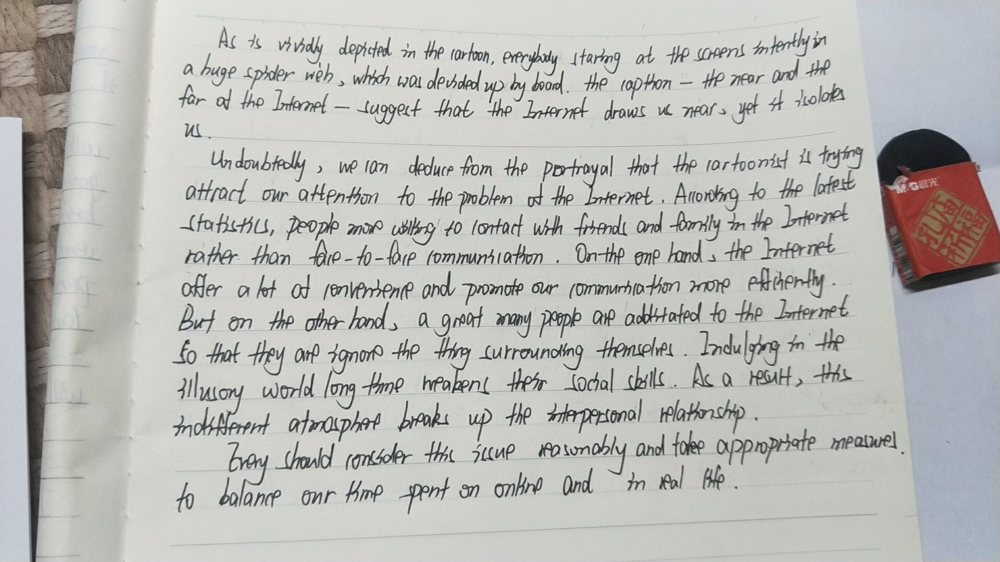

### 自己的作文

The picture presents a network consists of a many cells, each with a person inside gazing at the computer screen in front of him. Being close spatially though, they cannot talk to each other directly due to the walls surrounding them and are only able to commute through the computer network. The caption indicates that  although Internet helps to create connections between people far from each other, it can also create distance among neighboring ones.

Undoubtedly, the cartoonist is trying to warn us of the harm of addiction to the Internet. Indeed, as a powerful technology that has promoted globalization to a new era, Internet has created tremendous amount of value. With a lap-top or a smart phone, we can do things of great fun such as chatting with each other, browsing web pages and playing video games. However, when one is addicted to the virtual world of computer network, he will pay less attention to people around him, which may cause social problems. For instance, it is not uncommon to see in my college where several classmates sitting together to have lunch while each gazing at his or her cell phone without talking a word with others. There is also a worrying phenomenon where many teenagers addicted to video games have trouble learning at school and often have severe conflict with their parents.

It is my view that, first and for most, we should bear in mind that Internet is a double-edged sword that can exert profound influence for either good or bad on establishing and maintaining social connections. Using it in a controlled fashion will enable a great deal of chances while ensuring we have enough time to spend with our family and friends. Furthermore, regulations should be passed to protect adolescents, who has not much self control, from being addicted to video games and other potentially harmful usages.

### 遇到的问题

很多单词拼错，比如说cartoonist(两个o)，phenomenon，virtual（还有上一次的portrayal？）, 以及像Internet这种专有名词前面应该加the。平时不能光是背，还应该动手写一写，遇到不确定的单词一定标出来，回过头来再检查。很多背范文的经验里都强调默写，也是这个道理，如果实在没时间至少保证自己写完要过一遍，对不确定的单词加强复习；平时背诵复习的时候同样要抽出一些复杂的单词想想怎么拼。

时间安排方面，草稿应该尽量简单一点，能简写就简写，控制好时间，留出尽量多的时间誊写正式作文（这也是再次修改的过程）这次我用了20分钟构思和草稿，时间还是比较长，最好能15分钟搞定，20分钟正式誊写。

### 结构分析

第一段描述拆两句，一句转译标题。

第二段正反两个方面写Internet，正的方面嘛因为我对这个比较熟悉，吹Internet的材料很多，就写了Internet的应用还扯了一个对全球化的帮助（当然确实存在帮助，这一句也可以套用在别的地方）。反方面就是靠举例子，具体说明，怎么就不关心周围的人了

第三段吸取上次的教训，写了两点的做法，第一点就是增强意识，第二点实际上是针对未成年人强行凑出来的，只是为了让做法更丰满一点。（增强意识和立法应该算万金油做法了，主要就看怎么写的具体一些了，法律不要总是regulation should be passed，也可以说legislation should also be considered to provide guarantee for...）

### 范文分析

（王江涛书154页）尽管我自认为Internet是自己很熟悉的领域了，仍然在范文里看到不少好的表达

+ ironic：中文翻译是具有讽刺意味的，实际也可以用在指某些事物是意料之外的或者存在矛盾的地方（比如这里）。我记得在一本代数书的前言有这么一句话：Ironically, I was obsessed when I returned to the object again as a graduate. (前面刚刚说完在under graduate的时候对这个领域不感兴趣) 
+ The impressive metaphorical portrayal subtly reveals the duality of the relationship between man and the Internet... 这句非常厉害，表达某种事物具有两面性算是黄金必杀了。之前05年的时候还有一句"... is a double-edged sword that can exert profound influence for either good or bad on ..."是说某事像双刃剑，可以产生好的影响也可以产生不好的影响，我在上文也用到了。前面一句更广泛，可以描述某个事物的两个方面，表达可以用the duality of the nature of ...
+ indulged：用于描述沉湎非常合适。此外还有addiction，常见的还有obsession（05年范文），后面的rational(ly), irrational(ly)也经常在这种情景下出现。
+ fictitious：虚拟的，since fiction movie即科幻电影，同义词就是virtual，现在很火的VR全称就是Virtual Reality。
+ reluctant：不情愿地，相比unwilling用的少得多，用unwilling的时候就可以考虑是不是可以换成这个。
+ alienated：其实就表示被他人排斥。更常用的就是isolation。另外还可以有一个词较marginalization，表示边缘化，不知道是哪个大佬说的，公司里面总会有20%的人是傻×，当这20%的人走了，会有另外20%的人自动变成傻×，所以要对自己身边的菜鸡好一点，不然被marginalized的就是你了...
+ restrain from：阻止。这也是不常用的，常用的有prevent, stop, inhibit, prohibit, control（当然，程度不一样）

有必要说明的一点是，从范文中找可以套用的句子或者表达并用在自己的作文里__绝对不是俗套的做法__。天下文章一大抄，更何况英语考试本身还是语言考试，语言的学习过程就是不断地模仿然后内化。英语的单词总共还是有限个呢，用个单词总不能说我抄袭吧？__模板里面的经典表达都是能够相对准确表达一大类情况__。正确，熟练地使用它们，哪怕不会加分，至少不会扣分。而且使用这些大家都熟悉的句子能够让文章的结构一目了然，何乐而不为呢？至于很多人都担心的雷同问题，__真正容易雷同的都是非常简单的结构容易套用的结构，长难句，生僻单词往往很少被人使用到__。此外，__多积累同义表达，多揣摩适用情形，真正用的准确表达也不容易产生重复__。退一步，即使准确的表达被大量重复，也不能说就是不好，"the difference between right words and almost right words is just like the difference between lightening and light bugs."，哪怕换上一个不常见的近义表达，意思也差很多。最后，__文章论述的时候还可以结合自身举一些例子__，进一步增加文章的生动性。

### 手写版

### 讨论

__优点：__

+ 总体结构较清晰，第一段描述，有标志性的`As is vividly depicted in the cartoon`和`the caption —— ...`；第二段分析问题，开头点明；第三段完成呼吁。
+ 能够有意识的使用模板里面的例句而且能够变形。`According to the latest statistics`属于比较难论据支撑了，能够使用是非常好的意识，不同的支撑方式有其适用的场景，练习的时候都应该练到，考试的时候才能“对症下药”而不会因为没有练习过而发怵。

 __还可以再改进的地方：__

+ 对标题的转义：这里实际上更贴近于翻译了`the near and the far of the Internet`。但是near和far本身都没有名词的用法，这里这么写在语法上是存在问题的。__对这个问题完全不用感到沮丧__，因为大部分的标题都是中国人自己起的，更符合我们汉语的表达习惯。完整，准确地将标题翻译成英语实际上是有非常大的难度的。(想想2008年的例子，直接是一首打油诗，所以两篇范文实际上都是“转述”而不是“翻译”)

  然而作文里不可避免地要描述标题，所以这个时候通常使用“转述”(paraphrase)的方法，用意思等价的方式把这句话说出来即可。准确而比较省力的转述表达如__The caption indicates that...__， __We can learn from the caption that ...__ 

+ 关于列举调查相关的例子。举这样的例子的时候可以考虑这样几个因素：调查对__什么人__做了__什么实验__，得到了__什么结果__，以及__为什么__会得到这样的结果。这样写虽然会比较长，但是相应的逻辑结构会非常清楚。如果要写一个实验，完全可以考虑把这一段分给它。

  当然，这篇文章里是用一个实验的结果来作为论据，也没有问题

+ （待询问？）第二段的结构问题。如果希望把第二段写成正反式，有利有弊，则应该使用"on the one hand, on the other"，但开头又不是非常明显（没有说明duality）；如果希望写成“描述和分析”，则后面用"indeed"可能比"on the one hand"更加合适。

+ 如前所述，第三段通常是描述怎么做的，可以考虑稍微长一点，两点具体措施

+ 第二段的第一句`the problem of the Internet`有点稍显空泛，反而用的模板非常长，有点一口吃不到馅的着急的感觉，可以稍微具体一点，改成`the harm of addiction to the Internet upon interpersonal relationship`。

+ 存在一些语法错误
  + 第一句`every body staring at ...`实际上没有动词，应该加上is(As和which引导的都是从句)。第二段`people more willing to`也是类似的问题。`so that they are ignore`反而应该去掉系动词因为ignore是
  + 单三变化：如第二句`the caption ... suggest`
  + 动词的固定搭配：第二段第一句`cartoonist is trying to`(尽力做用to，尝试则try doing sth);`friends in(on) the Internet`; 
  + so that本身做连词的时候表示"为了什么目的而如何做"（相当于so as to）`... addictated to the Internet so that they are ignore...`不太适合表达“因为上网成瘾而忽略了与他人的交流”，可以用"so...that"(太...以至于)`so addictated to the Inteernet that they ignore...`（这一句中的thing应该为things）

+ 拼写错误：

  + `which was devided(divided) up by board`
  + `indulging in the illusony world`应该是illusionary
  + 第二段最后一句的`inderent`?

+ 书写质量还可以进一步提高，可以尝试打草稿，誊写的时候再专注。(i, e, c第一眼看不是特别清晰)

建议：

+ 练习转述以应对比较复杂的标题
+ 背诵能够解决语料贫乏的问题，但是对于培养语法的敏感度却不是非常有效，还是需要自己多动手写（抑或平时有意识地用英语表达一些东西），来培养自己对语法的敏感，减少低级错误。
+ 写作文之前打一遍草稿，草稿用来构思（保证连贯性和完整性），确定句子的大致形式，誊写的时候注意书写，保证语法，对细节稍加润色