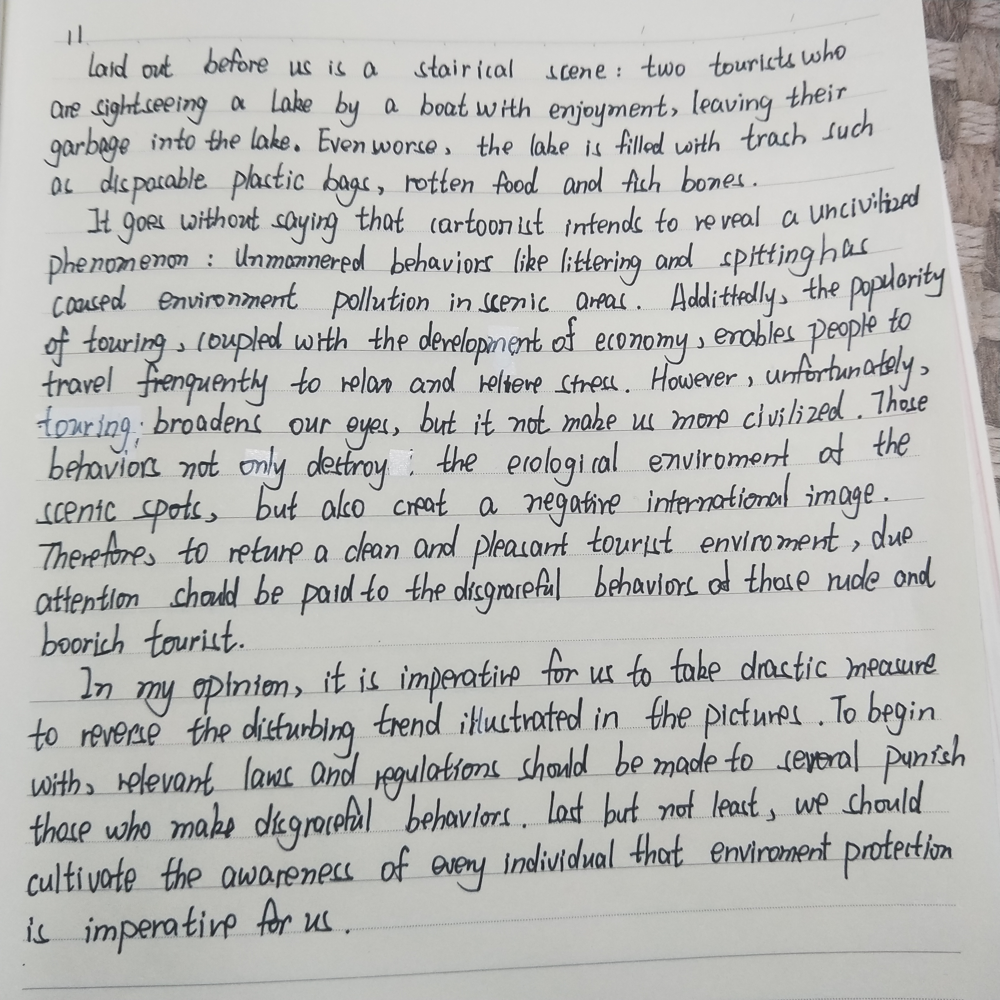

### 自己的作文

As is vividly demonstrated in the cartoon, a visiting boat is passing through a water with various litter floating around. Visitors on the boat are stilling throwing trash with casualty regardless of the fact that the water has been polluted to a mess. The caption indicates that too much waste has been left after a journey.

It is evident that the cartoonist is trying to warn us that tourism has caused severe pollution to our environment. The past decade has witnessed a boom of tourism in China. A large number of scenic areas has been opened to public, drastically enriching people's spare-time life as well as creating tremendous amount of wealth. However, as the number of tourists increases the amount of waste they produce quickly exceeds the areas' capacity to handle them. Consequently, trash can be seen everywhere, causing heavy damage to the original ecological systems. I can still remember the frustration when I first went to Qingdao  in the hope of seeing beaches beneath the sun shine, only to find polluted water with plastic bottles and bags floating everywhere.

It is my view that, first and for most, it is our duty to protect environment and always make sure to have trash properly disposed during journey. Further, it is imperative for local governments to take efforts establishing infrastructures for environment conservation such as trash bins and reminding signs. It is high time that we set up protecting the environment so as to develop tourism in a sustainable way.

### 存在的问题

大概是太久没写了，这次作文花的时间超过了45分钟，实在是...🤦‍一开始还在打草稿，后面发现时间不够了索性只写好提纲（每一段写哪几点），然后一句一句边想边写，好处是速度快了不少，坏处是少了修改的机会。

第一段想描述的东西太多了，反而花了时间进行了删减。但是看了宝宝的和范文的感觉还是从人开始叙述线条比较清楚，主次更加分明。

这次还犯了几个低级错误：

+ 可数性：垃圾通常都是不可数的，如litter, trash, waste.
+ 是Qingdao不是QingDao
+ 描述繁荣是boom不是bloom
+ 最后一句实在是太烂了，纸上写的版本是：Do it from now on and we are one day closer to a harmonious environment. 然而这跟主题相差太尼玛大了啊，后来就换成了上面这样，虽然还是比较生硬，但至少结构上完整一些了。

### 范文分析

基本结构是第一段描述，第二段是典型的用正反(on the one hand, on the other)说明问题，第三段没有说怎么做而是总结第二段然后呼吁。总结一遍第二段虽然一般，但是呼吁还是值得提倡的。

第二段第一句是当描述观点的句子很长的时候的一个模板，用冒号引出观点。

描述一样产业正在或者经历了一段__繁荣__的时期通常会用boom这个词。（注意不要写成bloom）。

shrug off：相当于neglect或者overlook(不是underlook哦，19年范文里倒是有一个underestimate)。

shore up：用梁或者柱子支撑某物，这里shore up economy就是支撑起经济发展的意思。

render: render本身有描绘的意思，也有导致的意思，如这里的render development unsustainable，就是导致不可持续发展的意思。

最后呼吁的时候除了only in this way ... 用It is high time也是不错的选择。当然也可以不采用任何句式，只要总结如是去做的好处，也能够实现呼吁的功能。

这篇范文相对比较简单，背诵的时候重点关注第二段论证正反两个方面的议论方法。以及最后一句的呼应。

### 小鹿手写版

### 讨论

__优点：__

+ 开头非常新颖（应该是satirical？）；
+ 第一段简洁且完整；
+ 真的，真的很多高级词汇，不少我也不认识的，比如`satirical`，`due attention`, `boorich`, `drastic measures`（但是用的是正确的！非常棒！！！）；
+ 书写也有进一步提高呀~

__小建议：__

+ 第一段加上对标题的描述；
+ 写完记得再仔细检查一下(`an uncivilized`， `drastic measures`， `does not make`， `severely punish`)；
+ 连词不需要使用的过于频繁，像第二段的`Additionally`可以删掉，后面一句相当于讲述背景。后面的`However`和`unfortunately`保留一个即可；
+ 有些句子可以说得更加充分一些，`negative international image`可以加上`when we travel abroad`。

