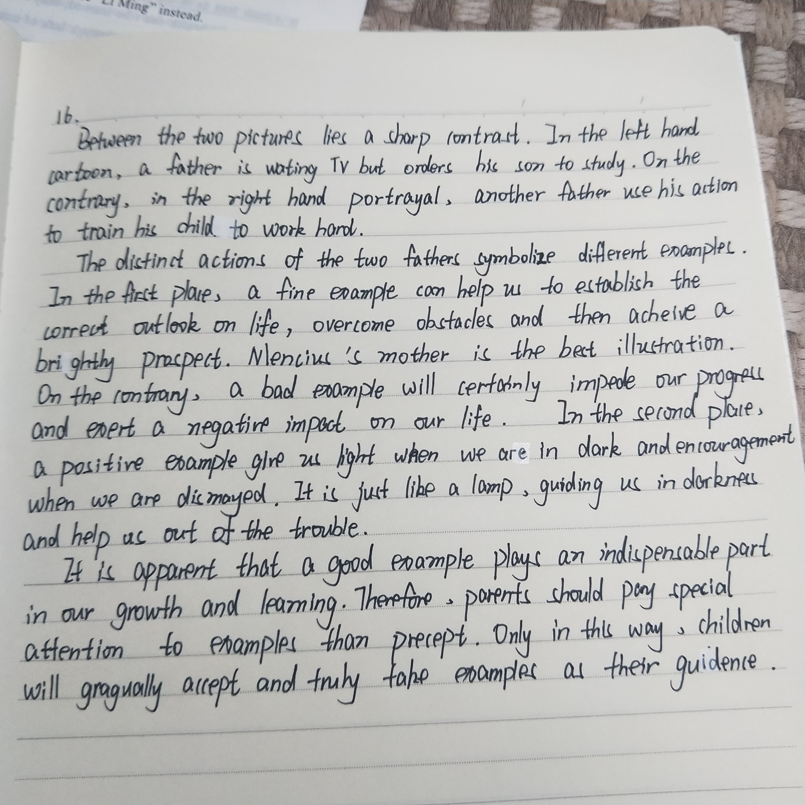

### 自己的作文

In the picture on the left, a father is watching television with a cigarette in his hand while asking his son to study hard. On the contrary, both the father and the son are working hard in front of their desks in the right picture. The caption says that parents should set up a figure for their children by their deeds rather than their words.

We can conclude from the portrayal that the painter tries to argue that parents should, in the first place, behave as what they expect their children to do. It is widely acknowledged that parents are life-long mentors of their children on every aspect of their life. The mismatch of their deeds and their words may render what they told their children to do less convincible. On the other hand, teaching by doing what they expect their children to do are not only more effective, but also helps to create better environment for the youth's growth. I can well remember I had a tough time learning mathematics in my junior high school. Instead of simply asking me to work harder, my father spent much time reviewing the courses and discussing problems with me. Finally I excelled in math exams and also developed an interest upon the subject.

In short, when It comes to education, parents should bear in mind that it is what they do rather than what they say everyday to their children that has a profound influence on the descendent's growth

### 遇到的问题

contrary，portrayal在敲进来的时候发现写错了🤦‍

第二段中想用`render sth ...`这个结构，但是硬是想不起来“令人怀疑的”要怎么说，原来稿子上写的是`unconvinceable`，然而并没有这个词，具有说服力的是`convincible`，不知道反义词是什么，最后写了个less ...算是表达相反的意思。

写到第三段实在是没有时间了，匆忙糊了一个总结，回过头来写总结完全可以，只是写的太着急了，如果前面加个标志性的总结的表述会更好（像`To sum up`或者`In a word`或者`To recap`）。

### 结构分析

我这是第一次在35分钟内写完整个稿子（但是没时间检查了😂）写的时候：

+ 第一段没有草稿只有几个关键词（心里想好应该只用3句话，第一段描述两张画面各一句，中间一共转折，最后加一句标题描述）；
+ 第二段列下中文提纲（很短的几句话）辅助上几个关键词（比较出彩的用词或者能帮助确定结构的词，像render）。基本的思路就是：
  + 背景——父母教育非常重要，
  + 正反陈述：如果言行不一致，那么就会不能令人信服，言行一致还能创造良好的环境；
  + 举例：实际上我爸也没教我学数学，这个例子是我模仿费恩曼教他儿子物理写的，然而我费恩曼怎么拼忘了，于是就嫁接到自己身上了🤦‍♂️
+ 第三段实在没时间了就写了个总结。这次的经验就是写总结前面还是应该加上`To sum up`这一类的话，看上去更加明显。

### 范文分析

文章的逻辑非常清晰，行文也很自然，相比于王江涛的版本更值得背诵。

+ immersed in their work respectively：沉浸在各自的工作中。absorbed也可以表示专注
+ Incontestably：毫无疑问，终于找到一个可以换掉undoubtedly的词了。
+ shed light on the importance：也是关注...的重要性的意思。之前的draw attention和utmost significance must be attached to也可以和它互换了
+ practice what they preach：和上面的example is better than precept以及下面的match words with deeds一样，都可以用于表示言行一致
+ actions speak louder than words：行胜于言，这是一句英语中的俗语

### 小鹿手写版

### 讨论

__优点：__

+ 结构非常清楚，逻辑顺畅，第一段用对比的方式描述图片，第二段并列中有正反，连词使用也很得体。
+ 使用词汇越来越准确，充分体现了词汇量(`outlook`，`prospect`, `impede`，`dismayed`，`indispensable`, `precept`)，很棒！

__建议：__

+ 第一段中的`train`似乎稍欠妥当，因为train通常表示训练，有命令的意味，这里换成`affect`，强调“影响”而不是“命令”。
+ 把存在的语法和拼写错误罗列如下，仅供参考，相较之前已经有非常明显的进步了！
  + 第一段`another father use`改成uses
  + 第二段`a fine example can help us to`去掉to，通常情况下help后面都是直接跟动词原型，加上to当然也可以，但是注意后面的并列成分`overcome obstacles...`也要加上to
  + `brighty prospect`应该是bright
  + `a positive example give us`应该为gives，后面的`dark`应该改成`darkness`
  + 最后一段`gragually`改成gradually

写完不禁感慨，小鹿的作文真是越写越好啦，不过还是要提醒宝宝，__注意保持阅读输入，注意写作不要间断，注意控制时间。__小鹿这两天都很辛苦，宝宝最棒！加油(ง •_•)ง~~~

