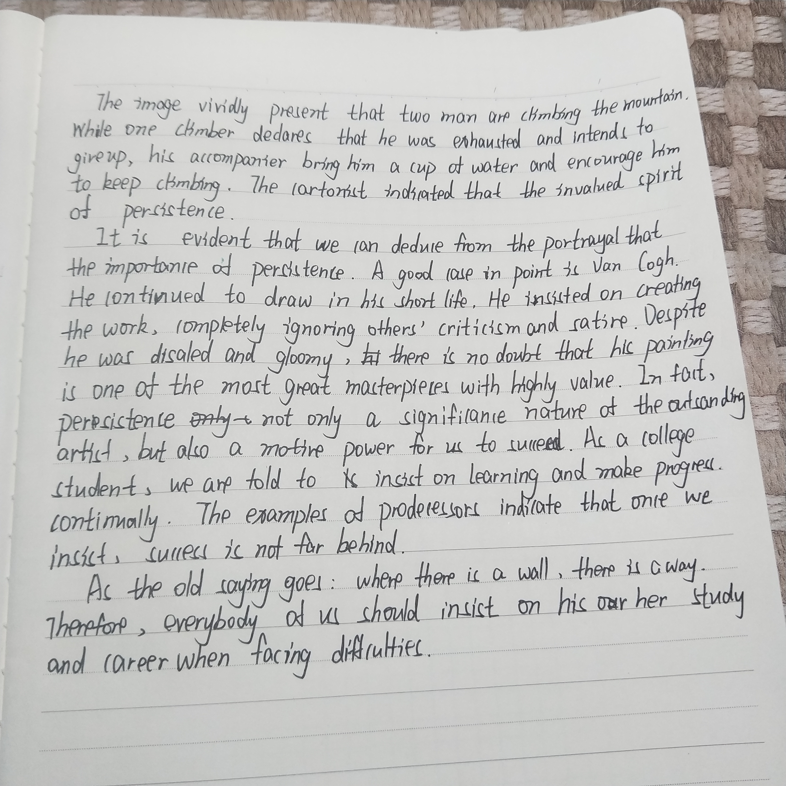

### 自己的作文

The picture presents a scene where two adolescents are on their half way climbing a mountain. Sitting on the stairs frustratedly,  one of them says that he is too tired to continue. While the other is delivering his companion  a bottle of water, encouraging him to continue after the short break.

Undoubtedly, the cartoonist is trying to draw our attention to the invaluable spirit of perseverance. With challenges lying ahead, many people can be easily defeated by imaginary obstacles. Only a small portion of strong willed people will go through all the tough time to achieve ultimate success. A good case in point is Zhang Yitang, who made great contribution in proving a long-standing conjuncture about prime numbers after decades of hard work. During the tough days he had to take part-time job in nearby restaurants to earn a living but his work is considered one of the most important breakthrough of this century.

Perseverance may lead to tough periods, yet it enables one to focus on one problem for longer time and try more approaches to solve it. As the saying goes, "no pains, no gains". Whatever situations we are confronted with, we shall bear in mind that those with the spirit of persistence are nearer to success. Just go one step further and we shall see the victory!

### 遇到的问题

拼错的单词：companion，perseverance, ultimate.

有一处固定搭配有问题，初稿的时候"those with the spirit ..."后面写的是to persist，考虑了一下还是改成"of" + 名词形式了。

时间上第一次尝试自己誊写，感觉差距还是好大啊🤦anyway这次打草稿的时间终于少了一点，大概是好久不写字了？我怎么感觉自己写的特别慢而且还越写越丑（大概是时间不够了😂）看来平常写一写还真是很重要啊

### 结构分析

第一段分析图中有什么，这次感觉标题太简单了就直接把“途中”融入到句子里面了（"on their half way doing"），但是范文里面还是有the caption indicates，看来这是雷打不动的了。标题虽然没有了但是人说的话还是要写的。这里用的是第三人称转述。相比直接翻译容易一些。

第二段是分析画面想表达什么。一开始我的想法是“画面表达了人们在面对困难时两种截然不同的反应，即坚持和放弃”。但是想了一下又觉得可能会很长而且重点不突出，基于上一次分析的09年的例子，我在这里开头就直接写了“the invaluable spirit of perseverance”,先表明是“挺”坚持的，至于放弃的人只是作为一种让步的陈述。然后举了张益唐的例子，宝宝举了梵高的例子，我的感受就是举什么都OK，但是篇幅要控制好，不宜太长，否则花费时间都很多。这个例子我有很多可以说的，但是考虑到时间比较紧迫，最终也就突出描述他怎么困难，这个成果如何厉害两个方面说即可。

最后一段实际上就是从理论上分析为什么需要坚持。这个思路类似于08年考试分析范文第三段的思路，那里也是第二段举例子然后第三段从理论层面分析。写了一句理由之后感觉不太够用了，然后又换了一个模板，08年的王江涛的第三段，"whatever difficulty or situations we are confronted with we should bear in mind/remind ourself that those with the spirit of ... are nearer to success"。实际上这里当时还想表达的一点就是如果你坚持了而别人都走了那你就是专家了，但是无奈时间不太够了。

### 范文分析

结构上，第一段描写，第二段说明为什么要坚持（一方面社会上的竞争更加激烈了，另一方面要是老觉得自己不行可能就真的不行了），最后一段总结也是套模板。总体的结构一般，但是有很多好句子好模板可以学习。

painstaking efforts：巨大的努力

第二段第一句又是一种说“这幅画想向人们说明...的重要性”的表达方法，另外一种就是"we can deduce from the portrayal that the cartoonist is trying to attract our attention to the issue of..."，本文的表达更为直接一些

"On account of..."这一句比较好的描述了因为高速发展而为个体带来的巨大压力。而这个原因在很多地方都可以用到。

overestimate... neglect...这对反义词

第三段第一句it is imperative to embrace the strong faith...适合用来表达我们需要具备...的信念。

making constant efforts这里又想到06年的"endeavor to bridge the gap between ... "，都是“少年仍需努力”的表达

show grace under pressure：表示在压力面前从容不迫。grace本身表示优雅。

### 手写版

### 讨论

__优点：__

+ 字迹明显比上一次更加工整，要继续加油哇～
+ 用了梵高的例子，而且名字写！对！了！非常棒！！！写完自己的例子和宝宝的比较觉得自己的例子还是有些小众(捂脸)毕竟英语老师对艺术家应该比对数学家更熟悉一些。
+ 第二段的结构很棒，从艺术家的例子谈及到每一个普通的在校大学生。
+ 用到了很多较高级的词汇，一遍读下来会加不少分。

 __还可以再改进的地方：__

+ 存在的语法问题：第二句的`brings`和`encourages`， 第二段`most great masterpieces`应该为`greatest masterpieces`，后面的`with highly value`可以直接改成invaluable加到masterpieces前面，注意highly是副词，只能修饰动词或者形容词。第三段的`everybody`后面一般不接介词，应该改成`everyone`。__关于时态问题，在描述的时候统一用一般现在时即可__
+ 拼写问题：第二句`clares`的c和l有点区分不清,第三句`invalued`应该为`invaluable`，第三段`where there is a will`
+ 第一段的第三句，`The cartonist indicated that the invaluable spirit of persistence`这里，that引导的应该是一个从句，但是invaluable spirit of persistence本身是一个名词的结构。可以考虑把that去掉（第二段的第一句也是同样的问题）；另外实际上当说这个作者怎么样的时候实际上完全可以用现在时（参看2008年关于合作的范文第二段第一句）。这里使用indicate就可以了。最后，这一句和第二段的第一句有点重复，考虑到caption本身比较简单，这一句也可以不要。
+ 关于“坚持”的变种说法，第二段里面多次用到的`insist on`通常是表示坚持某种观点，类似于argue that，这里如果不想用continue了可以换成keep on，never stops
+ `motive power`是否改成motivating power？
+ `be told to`颇有点被动的意味，换成`It is our duty`是不是更好一些呢？
+ 第二段的最后，成功不远了，应该是在前面不远处，而不是后面不远处，所以这里用`ahead`或者`beyond`应该更好一些。
+ 第三段的最后一句可能是快写完了比较着急，稍微有点牵强；这种时候实在没得可写了可以考虑直接上模板，同样能够完成呼吁的任务而且相对表达比较自然（不管面对什么困难，有强大毅力的人都不会放弃）。实际上是语言的连贯性问题，可以参考2008年考试分析第二段第三句"in other words, with challenges lying ahead..."。上一段说学生需要努力的时候也是如此，后面其实可以写学生有哪些通过努力获得成功的例子，比如一篇论文写了一个月最后终于通过非常欣慰，一方面是锻炼了自己写作的技能，另一方面也加深了自己对概念的理解。

__建议__：

+ 背熟范文，熟记好词好句，关注在什么样的情形下可以使用它们
+ 平常阅读和背诵的时候有意识的关注短语的固定搭配问题和词汇的语法特性，培养“语感”
+ 写完之后记得检查一遍。特别是检查有没有单三变化的错误（只要加个s就好啦）。